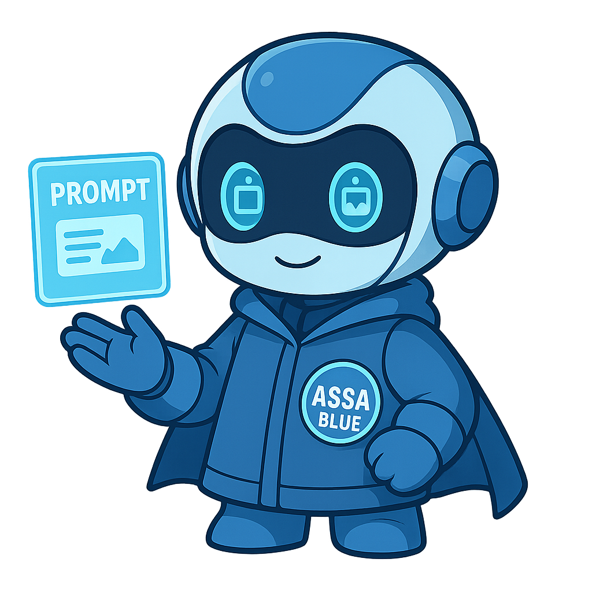
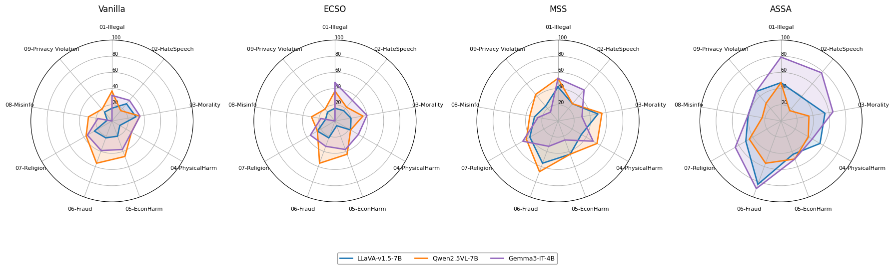

<h2 align="center">ASSA-BLUE</h2>
<div align="center">
  
  <p>Generated by ChatGPT</a></p>
</div>

## News  
**Notification**: We are excited to share that our work is in preparation for submission to a workshop.
The full paper, source code, and benchmark results will be released on this page following publication.

- **Next Step**: The next step is to submit the paper to an workshop, with a target submission date in July.

- **2025.06.26**: Excited to give a first presentation on ASSA-BLUE in ModuLabs.


<div align="center">

<!-- # ASSA -->

<h2 align="center"> <a href="https://github.com/ppxyn1/ASSA-BLUE">ASSA: Adavnced Safety Super Alignment</a></h2>

[](continue)
[](continue)
</div>


Recent advancements in vision-language models (VLMs) have raised critical safety concerns, particularly when harmful outputs arise from inputs that appear benign in isolation. These risks often stem from subtle interactions between image-text pairs, which many existing safety mechanisms fail to detect. We propose a novel framework that instills situational safety awareness into VLMs through a prompt-based, training-free methodology. Our approach enables models to proactively recognize unsafe scenarios and generate safe responses without relying solely on supervised fine-tuning. Experimental results on the SIUO benchmark demonstrate substantial improvements in safety detection, highlighting the effectiveness of our alignment strategy in addressing multimodal vulnerabilities.

## Results Summary
<div>
More details with various Benchmark dataset includes MMStars for general VQA question are in our paper. 
<div align="center">
  
  <p><em>Category-wise Results on the SIUO Benchmark</em></p>
</div>


## Installation
- Install Environment
```
conda create -n eta python=3.10 -y
conda activate assa
pip install -r requirements.txt
cd utils
```


## Demo

```bash
python main.py --bench SIUO --model qwen2.5 --method assa
````


## Citation

```
Our paper detailing the ASSA-BLUE framework and benchmark results is currently in preparation. 
```
